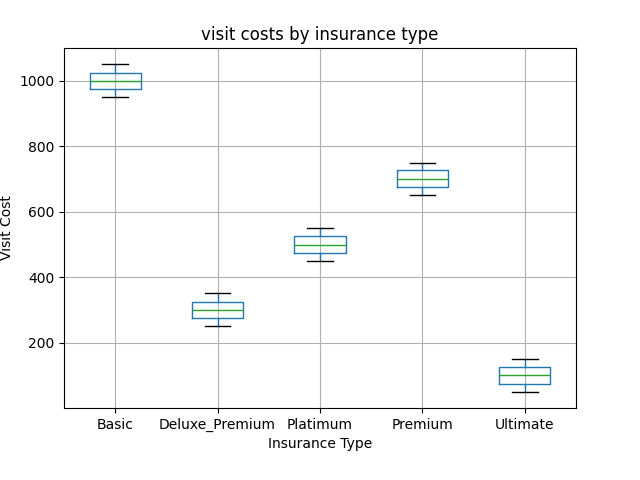
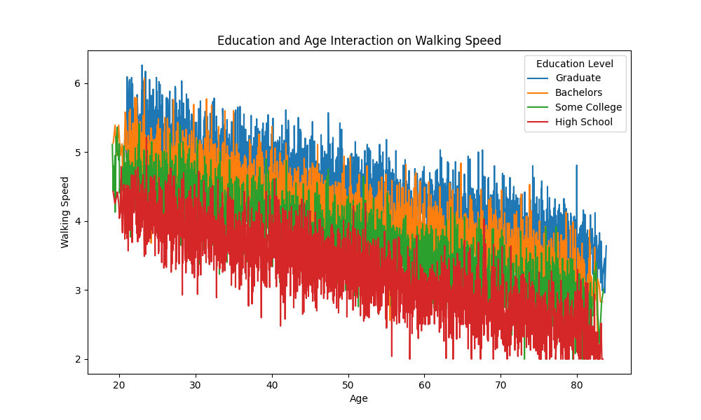

# DS-217 Final Exam: Multiple Sclerosis Analysis
## Question 1: Data Preparation with Command-Line Tools
####
I created a shell script named prepare.sh to handle the file creation and data cleaning. When running the script, it will change the current working directory to the file where the prepare.sh is located, then generate the dirty data csv file, clean the data with certain algorithms, and lastly save it into a CSV file called ms_data.csv.

To achieve this, I did cd "$(dirname "$0")" to navigate to the correct directory. I ran the generate_dirty_data.py file to generate the dirty data. For cleaning, I first attempted to remove the ms_data.csv to ensure no duplication if the shell script is ran multiple times. I then used grep -v E '^\s*$|^\s*#' to remove the spaces before the # symbol, the lines that have # leading, and the empty lines. Used awk -F, to go line by line removing the extra commas. Then I created a lst file to store the insurance_types. 

Below is a the summary of my first part:

------Summary of the Processed Data:------

there are 15449 visits/rows in the data(not including the headers)

------First 5 Visits:------

| patient_id | visit_date | age | education_level | walking_speed |
|-------------|-----------|----------------|---------------|---------------|
| [P0001]| [2020-01-07] | [74.65]   | [Graduate]   | [3.74]   |
| [P0001]| [2020-04-09] | [74.9]   | [Graduate]   | [3.59]   |
| [P0001]| [2020-10-02] | [75.39]   | [Graduate]   | [4.58]   |
| [P0001]| [2021-01-05] | [75.65]   | [Graduate]   |  [3.68]   |
| [P0001]| [2021-03-28] | [75.87]  | [Graduate] | [3.66]   |

## Question 2: Data Analysis with Python
### 1.Load and structure the data
####
In analyze_visits.py, I loaded the clean_ms.csv file with pandas. Then explicitedly assigned each column's data to expected datatypes. Sorted the entire file by patient_id and visit_date. 

### 2.Add insurance information
####
To assign insurance information, I opened the insurance.lst file I created earlier. I first extracted the unique patient_id from the data, then got the insurance types and stored it in a local list. I used random to randomly assign the insurance types based on the unique_ids, and lastly mapped the data back to the entire data. Then I used a function to assign the cost for each individual based on their insurance type.

### 3.Calculate summary statistics
The mean speed by education is:
| education_level | walking_speed |
|-------------|-----------|
| [Bachelors]| [4.037275] |
| [Graduate]| [4.415513] |
| [High School]| [3.267616] |
| [Some College]| [3.676484] |

The mean costs by differnet insurances:
| insurance_type | visit_cost |
|-------------|-----------|
| [Basic]| [1000.789775] |
| [Premium]| [699.285678] |
| [Platinum]| [499.405811] |
| [Deluxe_Premium]| [300.204955] |
| [Ultimate]| [99.955152] |

Age Effects on Walking Speed: correlation is -0.68

Age increases, walking speed decreases.

## Question 3: Statistical Analysis
### 1.Analyze walking speed
####
First, we removed the outliers for `walking_speed` and `visit_cost`. We identified 5 rows with outliers in `walking_speed`, while no outliers were found for `visit_cost`.

Next, we applied a multiple regression model with `education` and `age` as predictors. The resulting regression equation for `walking_speed` is:

`walking_speed` = 5.6153 + 0.4015 * `graduate` - 0.7999 * `high_school` - 0.4026 * `some_college` - 0.0303 * `age`

| variable | coefficient | p-value | [0.025 0.975] |
|-------------|-----------|----------------|---------------|
| [intercept]| [5.6153] | [0.000]   | [5.596, 5.634]   |
| [Graduate]| [0.4015] | [0.000]   | [0.386, 0.417]   |
| [High School]| [-0.7999] | [0.000]   | [-0.815, -0.785]   |
| [Some College]| [-0.4026] | [0.000]   | [-0.417, -0.388]   | 
| [age]| [-0.0303] | [0.000]  | [-0.031, -0.030] |

All predictors have p-values < 0.001, indicating they are highly significant contributors to the model. The model explains a substantial proportion of variance in walking speed (R² = 79.9%), making it a strong predictor. A mixed-effects model was fitted using walking_speed as the dependent variable, with age and education_level as fixed effects. A random intercept was added for each patient_id to account for repeated measurements from the same individuals. An OLS regression was performed with interaction terms (age * education_level) to test whether the effect of age on walking speed varies by education level.

### 2.Analyze costs
####
In this analysis, the effect of insurance type on visit costs was examined using ANOVA, descriptive statistics, boxplots, and effect size calculations.

For the ANOVA result, we got The F-statistic = 455063.67 with a p-value = 0.0, indicating a highly significant difference in visit costs across the insurance types.

The mean and standard deviation of visit costs were calculated for each insurance type:

| Insurance type | mean | standard deviation |
|-------------|-----------|----------------|
| [Basic]| [999.594127] | [29.112740]   |
| [Deluxe Premium]| [299.683954] | [29.178168]   |
| [Platinum]| [499.674427] | [28.469840]   |
| [Premium]| [700.279036] | [28.665564]   |
| [Ultimate]| [100.114571] | [28.993129]  |

Here is the boxplot which shows distinct separation between the groups, further confirming the ANOVA results.

For the effect sizes, we use pairwise comparisons between insurance types were performed to calculate effect sizes, revealing substantial differences:

Basic vs Premium: 𝑑 = 10.36

Basic vs Deluxe_Premium: d=24.29

Basic vs Ultimate: d=30.99

Premium vs Deluxe_Premium: d=13.94

Deluxe_Premium vs Ultimate: d=6.90

### 3.Advanced analysis
#### Interaction
The age, graduate, high school, some college are statistically significant(p-value = 0.000). None of the interaction terms between age and education_level are statistically significant. This suggests that the relationship between age and walking speed does not vary significantly by education level. No evidence of interaction effects between age and education_level was found.

| variable | coefficient | p-value | [0.025 0.975] |
|-------------|-----------|----------------|---------------|
| [intercept]| [5.6069] | [0.000]   | [5.576, 5.638]   |
| [Graduate]| [0.4015] | [0.000]   | [0.365, 0.460]   |
| [High School]| [-0.7999] | [0.000]   | [-0.844, -0.751]   |
| [High School]| [-0.3819] | [0.000]   | [-0.427, -0.337]   | 
| [age]| [-0.0301] | [0.000]  | [-0.031, -0.030] |
| [age:Graduate]| [-0.0002] | [0.630]  | [-0.001, 0.001] |
| [age:High School]| [-4.353e-05] | [0.920]  | [-0.001, 0.001] |
| [age:High School]| [-0.0004] | [0.337]  | [-0.001, 0.000] |

#### Confounders
The age, graduate, high school, some college is statistically significant(p-value = 0.000).
None of the insurance_type coefficients are statistically significant (p > 0.05).
This indicates that insurance type does not have a meaningful direct effect on walking speed. Insurance type does not appear to confound the relationship between education, age, and walking speed.
## Question 4: Data Visualization
### 1.Walking speed analysis
####

This plot shows the negative slope of the regression line indicates a decline in walking speed with age.

This plot shows that individuals with higher education levels tend to have higher walking speeds, while those with lower education levels have lower walking speeds.

This plot shows walking speed decreases with age across all education levels. Graduates consistently exhibit the highest walking speed across all ages. The lines are approximately parallel, indicating no significant interaction between education level and age.

### 2.Cost analysis
####

The bar plot shows the mean visit costs for each insurance type.

The box plot illustrates the distribution of visit costs for each insurance type.

### 3.Combined visualizations
####

The pair plot visualizes the relationships between age, walking_speed, and visit_cost, with color encoding for education_level. Education level influences the distributions of walking speed, with graduates showing higher speeds and narrower distributions, while high school individuals exhibit lower speeds and broader variability.

This plot shows faceted scatter plots of walking_speed vs age across different insurance types and education levels. Walking speed trends are relatively consistent across insurance types, suggesting that education has a stronger effect on walking speed than insurance.

This line plot visualizes the trends in walking_speed over time for different insurance types.

